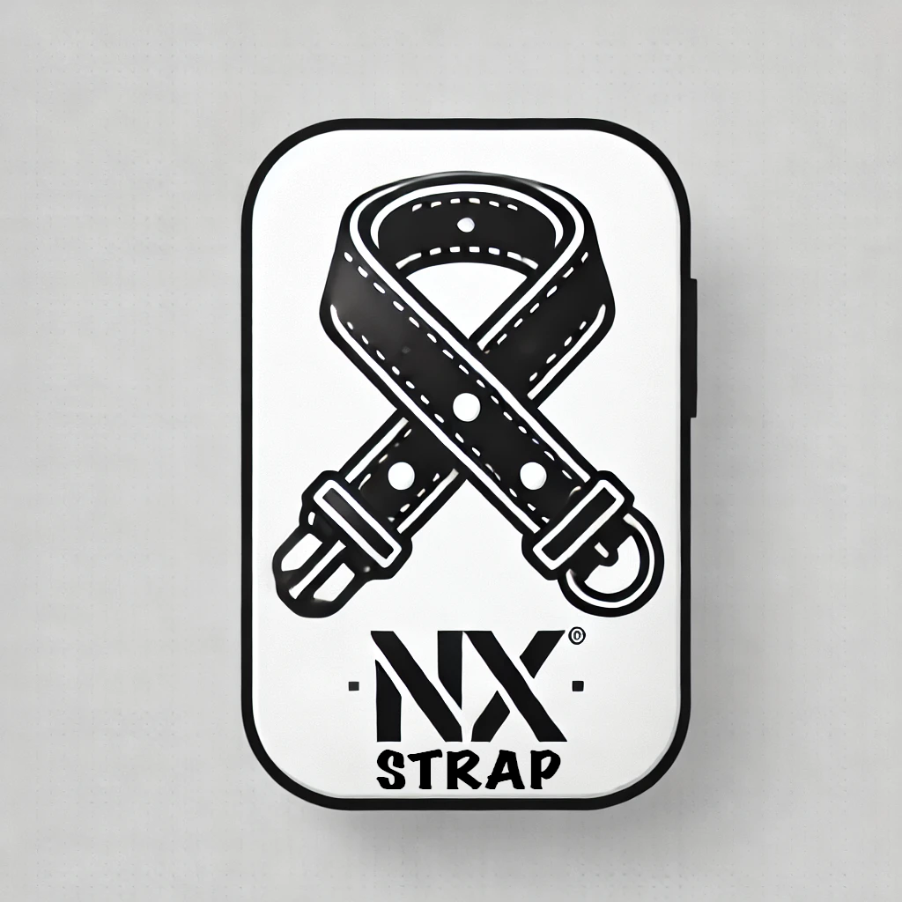

# NX Strap - A Modern NX Monorepo Boilerplate

### Features ✨

- 🏗️ **NX Monorepo Structure** - Organized workspace with apps and libs for maximum code reuse and maintainability.
- ⚡ **Next.js Frontend** - Modern, performant frontend built with Next.js featuring server-side rendering and static generation.
- 🔐 **Express Gateway** - Robust API gateway built with Express.js for secure and efficient request handling.
- 📦 **Shared Libraries** - Dedicated libraries for UI components and data access layers to promote code reuse.
- 🎨 **Modern Styling** - Powered by TailwindCSS for beautiful, responsive, and customizable designs.
- 🧪 **Full Test Suite** - Comprehensive testing with Jest for unit tests and Cypress for E2E testing.
- 📈 **Scalable Architecture** - Built for enterprise-grade applications with clear separation of concerns and best practices.

### Getting Started 🚀

1. Clone this repository
2. Rename the project:
   - Search and replace all instances of `frontend` with your `project_name`
   - Update the project name in `package.json`
   - Update the project name in `nx.json`
3. Run `pnpm install`
4. Rename the `.env.example` file to `.env` and **populate it with your own values**
5. Run `nx serve frontend` to start the Next.js frontend
6. Run `nx serve gateway` to start the Express gateway

Feel free to contribute or suggest improvements! 🤝

### Project Structure 📁

```
project_name/
├── apps/
│   ├── frontend/     # Next.js frontend application
│   └── gateway/      # Express.js API gateway
├── libs/
│   ├── ui/          # Shared UI components
│   └── data-access/ # Data access and API integration layer
```

### Credits 🙏

This project aims to provide a robust starting point for building scalable applications using NX monorepo architecture. Special thanks to the NX, Next.js, and Express.js communities for their excellent tools and documentation.
