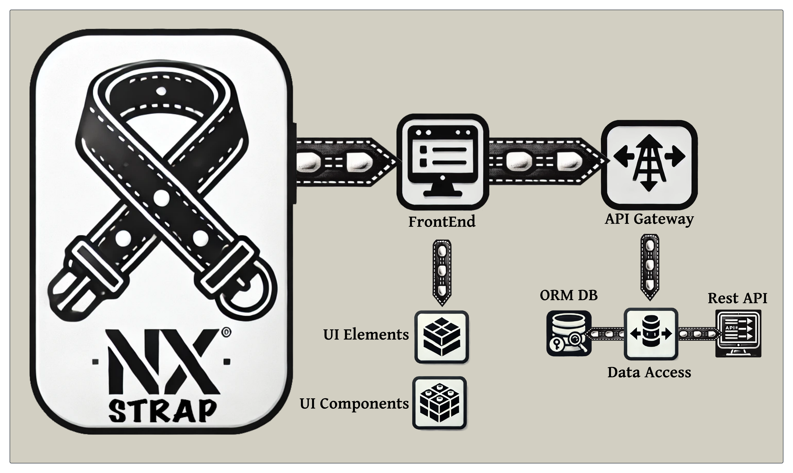

[](https://nx.dev)
[](https://nextjs.org)
[](https://expressjs.com)
[](https://www.typescriptlang.org)
[](https://tailwindcss.com)
[](https://storybook.js.org)
[](https://pnpm.io)

# NX Strap - A Modern NX Monorepo Boilerplate

### Features ✨

- 🏗️ **NX Monorepo Structure** - Efficient workspace organization for optimal code sharing and maintenance
- ⚡ **Next.js Frontend** - Server-side rendered React application with static generation capabilities
- 🔐 **Express Gateway** - Dynamic API gateway for modular request routing and handling
- 📦 **Modular APIs** - Self-contained API libraries that seamlessly integrate with the gateway
- 🎨 **Modern Styling** - Responsive and customizable designs using TailwindCSS
- 🧪 **Full Test Suite** - Jest unit testing and Cypress E2E testing integration
- 📈 **Scalable Architecture** - Enterprise-ready design with clear separation of concerns
- 🔄 **Continuous Integration** - Automated testing pipeline using GitHub Actions
- 📚 **Storybook** - Interactive component development and documentation

### Getting Started 🚀

1. Clone this repository
   ```bash
   git clone https://github.com/yourusername/nx-strap.git
   cd nx-strap
   ```
2. Rename the project:
   - Search and replace all instances of `nx-strap` with your `project_name`
   - Update the project name in `package.json`
   - Update the project name in `nx.json`
3. Run `make install` to install all dependencies
4. Rename the `.env.example` file to `.env` and **populate it with your own values**
5. Run `make dev` to start both the frontend and API gateway in parallel

For a list of all available development commands, run `make help`.

### Development Commands 🛠️

The project includes a Makefile for common development tasks. Running `make help` shows all available commands:

```bash
NX Strap Development Commands:
make install    - Install all dependencies
make clean      - Clean build artifacts and dependencies
make dev        - Start development servers
make test       - Run all tests
make lint       - Run linting
make build      - Build all applications
make serve-all  - Serve all applications
make e2e        - Run end-to-end tests
make testsuite  - Run all test jobs (test, lint, e2e)
make storybook  - Start Storybook development server
make build-storybook - Build Storybook for production
```

Feel free to contribute or suggest improvements! 🤝

### Project Structure 📁

```
project_name/
├── apps/
│   ├── frontend/        # @nx-strap/source - Next.js frontend application
│   ├── frontend-e2e/    # Frontend end-to-end tests
│   ├── api-gateway/     # ApiGateway - Routes requests to appropriate API implementations
│   └── api-gateway-e2e/ # API gateway end-to-end tests
├── libs/
│   ├── data-access/     # @nx-strap/data-access - API implementation libraries
│   │   └── api-example/ # Example API module that injects routes into the gateway
│   └── ui/             # @nx-strap/ui - Shared UI components
│       └── components/ # React components with Storybook documentation
```

### Import Rules 📦

1. **Frontend App** (`apps/frontend/`):

   ```typescript
   import { ComponentName } from '@frontend/ui';
   import { routeName } from '@frontend/data-access';
   ```

2. **API Gateway** (`apps/api-gateway/`):

   ```typescript
   import { routeName } from '@frontend/data-access';
   ```

3. **UI Library** (`libs/ui/components/`):

   ```typescript
   // Internal imports
   import { Component } from './lib/component-name';
   // Export path: @frontend/ui
   ```

4. **Data Access Library** (`libs/data-access/api-example/`):
   ```typescript
   // Internal imports
   import { route } from './lib/route-name';
   // Export path: @frontend/data-access
   ```

### Architecture Overview 🏛️

The project follows a modular API architecture where:

- The `api-gateway` acts as a central routing layer, handling incoming HTTP requests
- API implementations live in the `data-access` directory as separate libraries
- Each API module injects its routes into the gateway at runtime
- This separation allows for:
  - Independent development and testing of API modules
  - Clear boundaries between different API domains
  - Easy addition of new API functionality without modifying the gateway
  - Better code organization and maintainability

### Credits 🙏

This project aims to provide a robust starting point for building scalable applications using NX monorepo architecture. Special thanks to the NX, Next.js, and Express.js communities for their excellent tools and documentation.
